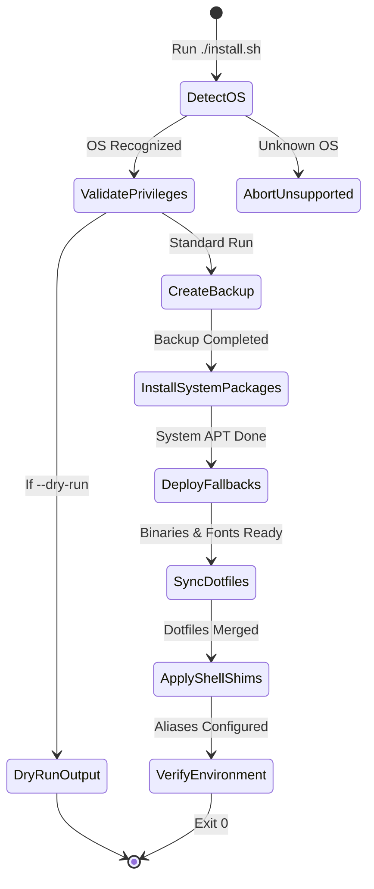

# Data Model: Ubuntu Support & Multi-Distro Installation

**Feature**: `001-ubuntu-support`
**Date**: 2026-08-20

## Core Entities

### 1. OS Profile
Represents host system identity and packaging metadata resolved at runtime.

| Attribute | Type | Description | Example Values |
|---|---|---|---|
| `os_id` | String | Value of `ID` from `/etc/os-release` | `ubuntu`, `debian`, `arch`, `fedora`, `opensuse-tumbleweed` |
| `os_id_like` | String | Value of `ID_LIKE` from `/etc/os-release` | `debian`, `ubuntu debian`, `arch`, `fedora` |
| `os_version_id`| String | Value of `VERSION_ID` | `24.04`, `40`, `20240801` |
| `os_family` | Enum | Canonical distribution family | `DEBIAN`, `ARCH`, `FEDORA`, `SUSE`, `UNKNOWN` |
| `pkg_manager` | Enum | Primary system package manager tool | `apt`, `pacman`, `dnf`, `zypper` |
| `pkg_install_cmd`| String | Command prefix for non-interactive installation | `sudo apt-get install -y --no-install-recommends`, `sudo pacman -Sy --noconfirm` |

### 2. Package Manifest
Declarative catalog defining multi-distro package mappings and fallback mechanisms for each capability.

| Attribute | Type | Description | Example Values |
|---|---|---|---|
| `capability_id` | String | Logical feature / tool identifier | `status-bar`, `desktop-shell`, `pager`, `fuzzy-finder` |
| `arch_pkg` | String | Pacman / AUR package name | `quickshell-git`, `waybar`, `bat`, `fd` |
| `fedora_pkg` | String | DNF package name | `waybar`, `bat`, `fd-find` |
| `suse_pkg` | String | Zypper package name | `waybar`, `bat`, `fd` |
| `ubuntu_pkg` | String | APT package name (if available in official repo) | `waybar`, `batcat`, `fd-find`, `rofi-wayland` |
| `fallback_type` | Enum | Mechanism when APT package is missing/outdated | `NONE`, `PPA`, `GITHUB_RELEASE_BIN`, `SCRIPT`, `FONT_TARBALL` |
| `fallback_source` | String | URL / PPA name / repository tag | `ppa:hyprland-community/hyprland`, `eza-community/eza` |
| `install_target`| String | Target directory for fallback binary/asset | `~/.local/bin`, `~/.local/share/fonts` |

### 3. Backup Manifest
Record of pre-existing user configurations backed up prior to installer operations.

| Attribute | Type | Description | Example Values |
|---|---|---|---|
| `backup_id` | String | Timestamped identifier for the backup snapshot | `ml4w-backup-20260820-083000` |
| `timestamp` | ISO-8601 | Time the backup was initiated | `2026-08-20T08:30:00Z` |
| `source_paths` | Array<String> | Config directories scanned and backed up | `["~/.config/hypr", "~/.config/quickshell", "~/.bashrc"]` |
| `destination_path`| String | Target backup root directory | `~/.mydotfiles/backups/ml4w-backup-20260820-083000` |
| `status` | Enum | Result state of the backup operation | `SUCCESS`, `PARTIAL`, `SKIPPED_EMPTY`, `FAILED` |

---

## State Transitions

### Installation Lifecycle State Machine

