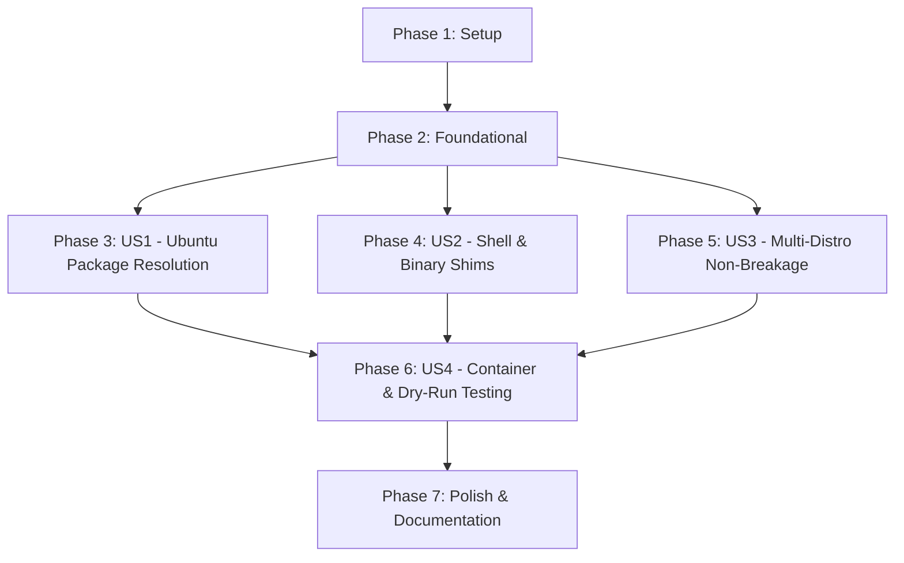

# Tasks: Ubuntu Support for Dotfiles & Installer

**Input**: Design documents from `/specs/001-ubuntu-support/`
**Prerequisites**: [plan.md](file:///Users/deww/Repos/per/ml4w-ubuntu-dotfiles/specs/001-ubuntu-support/plan.md), [spec.md](file:///Users/deww/Repos/per/ml4w-ubuntu-dotfiles/specs/001-ubuntu-support/spec.md), [research.md](file:///Users/deww/Repos/per/ml4w-ubuntu-dotfiles/specs/001-ubuntu-support/research.md), [data-model.md](file:///Users/deww/Repos/per/ml4w-ubuntu-dotfiles/specs/001-ubuntu-support/data-model.md), [contracts/installer-interface.md](file:///Users/deww/Repos/per/ml4w-ubuntu-dotfiles/specs/001-ubuntu-support/contracts/installer-interface.md)

## Format: `[ID] [P?] [Story] Description`

- **[P]**: Can run in parallel (different files, no dependencies)
- **[Story]**: Which user story this task belongs to (`US1`, `US2`, `US3`, `US4`)
- All tasks include exact file paths.

---

## Phase 1: Setup (Directory Structure & Scaffolding)

**Purpose**: Establish the modular installer directory layout and helper skeletons.

- [X] T001 Create installer directory layout `install/distros/`, `install/fallbacks/`, and `tests/`
- [X] T002 [P] Create common installer helper library skeleton in `install/common.sh`

---

## Phase 2: Foundational (Core OS Detection, Argument Parsing & Backup Engine)

**Purpose**: Core infrastructure required before distribution package handlers can execute.

**⚠️ CRITICAL**: Must complete before user story specific installers are integrated.

- [X] T003 Implement `/etc/os-release` detection logic (`ID` and `ID_LIKE` parser) in `install/os-detect.sh`
- [X] T004 [P] Implement timestamped configuration backup engine (`~/.mydotfiles/backups/ml4w-backup-YYYYMMDD-HHMMSS`) in `install/backup.sh`
- [X] T005 Refactor top-level CLI argument parser (`--dry-run`, `--noconfirm`, `--bar`, `--help`) in `install.sh`
- [X] T006 Implement dry-run command logging wrapper functions in `install/common.sh`

**Checkpoint**: Foundation ready — OS detection, safe backup, and dry-run execution harness operational.

---

## Phase 3: User Story 1 - Ubuntu 24.04+ Environment Installation & Package Resolution (Priority: P1) 🎯 MVP

**Goal**: Full installation of desktop environment, Wayland tools, CLI packages, and fonts on Ubuntu 24.04 LTS via APT, PPAs, and user-local fallbacks.

**Independent Test**: Execute `./install.sh` on a clean Ubuntu 24.04 system; verify all packages install, Quickshell (or Waybar fallback) is configured, and desktop utilities launch properly.

### Implementation for User Story 1

- [X] T007 [US1] Create Ubuntu APT package list and repository handler (main/universe + PPAs) in `install/distros/ubuntu.sh`
- [X] T008 [P] [US1] Implement Quickshell binary deployer and Qt6 runtime installer (`libqt6quick6`, `libqt6qml6`, `qml6-module-qtquick-*`) in `install/fallbacks/quickshell.sh`
- [X] T009 [P] [US1] Implement GitHub release binary downloaders for `eza`, `fastfetch`, `starship`, and `zoxide` deploying to `~/.local/bin` in `install/fallbacks/tools.sh`
- [X] T010 [P] [US1] Implement Nerd Fonts downloader (Meslo/JetBrains) deploying to `~/.local/share/fonts` and font cache refresher in `install/fallbacks/fonts.sh`
- [X] T011 [US1] Integrate Waybar secondary fallback configuration setup in `install/distros/ubuntu.sh`
- [X] T012 [US1] Wire Ubuntu package installer, fallback deployers, and dotfile sync into main orchestration in `install.sh`

**Checkpoint**: User Story 1 functional — Ubuntu 24.04 can run the installer end-to-end and provision all desktop & CLI components.

---

## Phase 4: User Story 2 - Debian/Ubuntu Shell & Command Name Compatibility (Priority: P2)

**Goal**: Standardize CLI commands across Debian/Ubuntu (`bat` ↔ `batcat`, `fd` ↔ `fdfind`) and ensure environment paths (`~/.local/bin`) are consistently exported.

**Independent Test**: Launch interactive `bash` and `zsh` subshells on Ubuntu; verify `bat`, `fd`, `eza`, and `fastfetch` resolve correctly and ML4W scripts run without command-not-found errors.

### Implementation for User Story 2

- [X] T013 [P] [US2] Add Debian/Ubuntu conditional binary shims (`batcat` → `bat`, `fdfind` → `fd`) and path exports in `.config/bashrc/10-aliases`
- [X] T014 [P] [US2] Add Debian/Ubuntu conditional binary shims and path exports in `.config/zshrc/25-aliases`
- [X] T015 [P] [US2] Add Debian/Ubuntu conditional binary shims and path exports in `.config/fish/conf.d/10-aliases.fish`
- [X] T016 [US2] Update `.config/bashrc/00-init` and `.config/zshrc/00-init` to ensure `~/.local/bin` is in `$PATH` on login

**Checkpoint**: User Story 2 functional — shell aliases and command names work transparently across both Debian/Ubuntu and standard upstream distributions.

---

## Phase 5: User Story 3 - Safe Backup, Idempotency & Multi-Distro Non-Breakage (Priority: P3)

**Goal**: Guarantee safe pre-installation backups, idempotent re-runs, and 100% backward compatibility for Arch Linux, Fedora, and openSUSE.

**Independent Test**: Run `./install.sh` multiple times consecutively on Ubuntu, Arch, Fedora, and openSUSE; verify pre-existing configs are backed up, no duplicate settings are appended, and non-Ubuntu distros retain their native package paths.

### Implementation for User Story 3

- [X] T017 [P] [US3] Port native Arch Linux / Pacman installation handler to `install/distros/arch.sh`
- [X] T018 [P] [US3] Port native Fedora / DNF installation handler to `install/distros/fedora.sh`
- [X] T019 [P] [US3] Port native openSUSE / Zypper installation handler to `install/distros/suse.sh`
- [X] T020 [US3] Integrate automated pre-install backup invocation before dotfile sync in `install.sh`
- [X] T021 [US3] Add idempotency guards to prevent duplicate configuration blocks or symlink errors across all distributions in `install.sh`

**Checkpoint**: User Story 3 functional — multi-distro non-breakage verified, backups safe, and installer is strictly idempotent.

---

## Phase 6: User Story 4 - Dry-Run Mode & Automated Containerized Verification (Priority: P4)

**Goal**: Provide non-destructive dry-run inspection and an automated container testing harness for CI/CD and verification.

**Independent Test**: Execute `./install.sh --dry-run` and run `tests/test-ubuntu-container.sh` to validate the full workflow in a fresh `ubuntu:24.04` container.

### Implementation for User Story 4

- [X] T022 [P] [US4] Create Dockerfile for Ubuntu 24.04 testing in `tests/Dockerfile.ubuntu2404`
- [X] T023 [US4] Create automated container verification test script in `tests/test-ubuntu-container.sh`
- [X] T024 [US4] Add dry-run simulation mode validation for package installs and file copy steps in `install.sh`

**Checkpoint**: User Story 4 functional — container test suite executes non-interactively and dry-run validates clean execution.

---

## Phase 7: Polish & Cross-Cutting Concerns

**Purpose**: Documentation updates, executable file permissions, and final validation.

- [X] T025 [P] Update `README.md` with Ubuntu 24.04 installation guide, package notes, and Quickshell/Waybar toggle
- [X] T026 Ensure executable permissions (`chmod +x`) on all scripts in `install.sh`, `install/**/*.sh`, and `tests/*.sh`
- [X] T027 Run quickstart validation scenarios from `specs/001-ubuntu-support/quickstart.md`

---

## Dependencies & Execution Order

### Parallel Opportunities

- **Phase 1**: T002 can run in parallel with T001.
- **Phase 2**: T004 (backup.sh) can run in parallel with T003 (os-detect.sh).
- **Phase 3 (US1)**: T008 (quickshell), T009 (tools), and T010 (fonts) can be implemented in parallel.
- **Phase 4 (US2)**: T013 (bashrc), T014 (zshrc), and T015 (fish) can be implemented in parallel.
- **Phase 5 (US3)**: T017 (arch), T018 (fedora), and T019 (suse) can be implemented in parallel.
- **Phase 6 (US4)**: T022 (Dockerfile) can be implemented in parallel with T023.

---

## Implementation Strategy

### MVP First (User Story 1 Only)
1. Complete Phase 1 (Setup) and Phase 2 (Foundational).
2. Complete Phase 3 (User Story 1: Ubuntu Package Resolution & Fallbacks).
3. Validate on a clean Ubuntu system with `./install.sh`.

### Incremental Delivery
1. Add Phase 4 (User Story 2) → Verify `bat` and `fd` shims in bash/zsh/fish.
2. Add Phase 5 (User Story 3) → Verify Arch/Fedora/openSUSE multi-distro routing and backup creation.
3. Add Phase 6 (User Story 4) → Run automated container tests via `tests/test-ubuntu-container.sh`.
4. Finalize Phase 7 (Polish) → Update `README.md` and complete quickstart checks.
