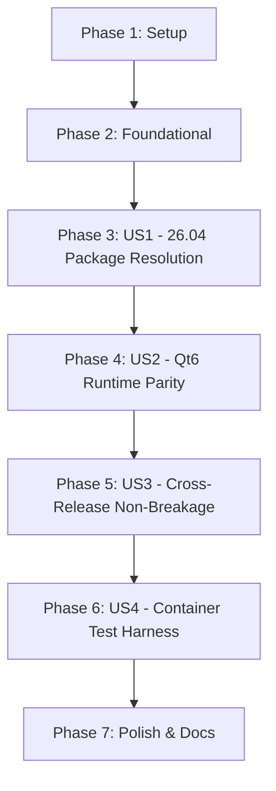

# Tasks: Ubuntu 26.04 Compatibility & Refactoring

**Input**: Design documents from `/specs/002-ubuntu-2604-compatibility/`
**Prerequisites**: [plan.md](file:///Users/deww/Repos/per/ml4w-ubuntu-dotfiles/specs/002-ubuntu-2604-compatibility/plan.md), [spec.md](file:///Users/deww/Repos/per/ml4w-ubuntu-dotfiles/specs/002-ubuntu-2604-compatibility/spec.md), [research.md](file:///Users/deww/Repos/per/ml4w-ubuntu-dotfiles/specs/002-ubuntu-2604-compatibility/research.md), [data-model.md](file:///Users/deww/Repos/per/ml4w-ubuntu-dotfiles/specs/002-ubuntu-2604-compatibility/data-model.md)

## Format: `[ID] [P?] [Story] Description`

- **[P]**: Can run in parallel (different files, no dependencies)
- **[Story]**: Which user story this task belongs to (`US1`, `US2`, `US3`, `US4`)
- All tasks include exact file paths.

---

## Phase 1: Setup (Verification Scaffolding)

**Purpose**: Prepare test and feature environment for Ubuntu 26.04 refactoring.

- [X] T001 Create Ubuntu 26.04 test scaffolding files in `tests/`

---

## Phase 2: Foundational (OS & Codename Detection)

**Purpose**: Core OS detection updates for Ubuntu 26.04 releases.

- [X] T002 Update `/etc/os-release` parser to extract `VERSION_CODENAME` and `OS_VERSION_MAJOR` in `install/os-detect.sh`

**Checkpoint**: Foundation ready — Ubuntu 26.04 detected accurately.

---

## Phase 3: User Story 1 - Ubuntu 26.04 Installation & Package Resolution (Priority: P1) 🎯 MVP

**Goal**: Seamless package resolution, PPA error containment, and binary fallbacks on Ubuntu 26.04.

**Independent Test**: Run `./install.sh --dry-run` and live install on an Ubuntu 26.04 environment; verify all packages and fallbacks resolve without 404 or missing package errors.

### Implementation for User Story 1

- [X] T003 [US1] Refactor `install/distros/ubuntu.sh` with resilient package probe loops and 26.04 compatibility
- [X] T004 [P] [US1] Implement safe PPA verification and fallback containment for missing 26.04 PPA suites in `install/distros/ubuntu.sh`
- [X] T005 [P] [US1] Update Quickshell fallback binary installer for Ubuntu 26.04 in `install/fallbacks/quickshell.sh`
- [X] T006 [US1] Ensure CLI tools and fonts fallbacks operate cleanly on 26.04 in `install/fallbacks/tools.sh` and `install/fallbacks/fonts.sh`

**Checkpoint**: User Story 1 complete — Ubuntu 26.04 resolves packages cleanly with automated fallback containment.

---

## Phase 4: User Story 2 - Qt6 & Desktop Shell Parity (Priority: P2)

**Goal**: Full Qt6 and Wayland rendering compatibility for Quickshell on Ubuntu 26.04.

**Independent Test**: Verify Qt6 runtime package set installs on 26.04 and Waybar secondary fallback operates properly.

### Implementation for User Story 2

- [X] T007 [US2] Update Qt6/QML runtime package list in `install/distros/ubuntu.sh` with `libqt6waylandclient6` and `qt6-qpa-plugins`
- [X] T008 [US2] Verify Waybar fallback auto-detection when Quickshell is absent in `install/fallbacks/quickshell.sh`

**Checkpoint**: User Story 2 complete — Qt6 runtime dependencies verified for Ubuntu 26.04.

---

## Phase 5: User Story 3 - Cross-Release Non-Breakage (Priority: P3)

**Goal**: Ensure zero regressions across Ubuntu 24.04, Arch, Fedora, and openSUSE.

**Independent Test**: Execute `./install.sh --dry-run` and verify non-Ubuntu distributions and 24.04 retain exact behavior.

### Implementation for User Story 3

- [X] T009 [US3] Verify backward compatibility for Ubuntu 24.04, Arch, Fedora, and openSUSE in `install/distros/*.sh`

**Checkpoint**: User Story 3 complete — cross-release compatibility verified.

---

## Phase 6: User Story 4 - Containerized CI & Test Harness (Priority: P4)

**Goal**: Automated test harness for Ubuntu 26.04 container verification.

**Independent Test**: Execute `tests/test-ubuntu2604-container.sh` in an Ubuntu 26.04 / rolling container.

### Implementation for User Story 4

- [X] T010 [P] [US4] Create `tests/Dockerfile.ubuntu2604` for containerized 26.04 testing
- [X] T011 [US4] Create automated test script in `tests/test-ubuntu2604-container.sh`

**Checkpoint**: User Story 4 complete — automated test harness operational.

---

## Phase 7: Polish & Documentation

**Purpose**: Documentation updates and permission checks.

- [X] T012 [P] Update `README.md` with explicit Ubuntu 26.04 LTS verified support
- [X] T013 Ensure executable permissions (`chmod +x`) on all installer and test scripts

---

## Dependencies & Execution Order

### Implementation Strategy

### MVP First (User Story 1 Only)
1. Complete Phase 1 (Setup) and Phase 2 (Foundational: OS detect).
2. Complete Phase 3 (US1: Ubuntu 26.04 package resolution & safe PPA probing).
3. Validate on Ubuntu 26.04.

### Incremental Delivery
1. Add Phase 4 (Qt6 runtime parity).
2. Add Phase 5 (Cross-release non-breakage verification).
3. Add Phase 6 (Container test harness).
4. Polish documentation in `README.md`.
